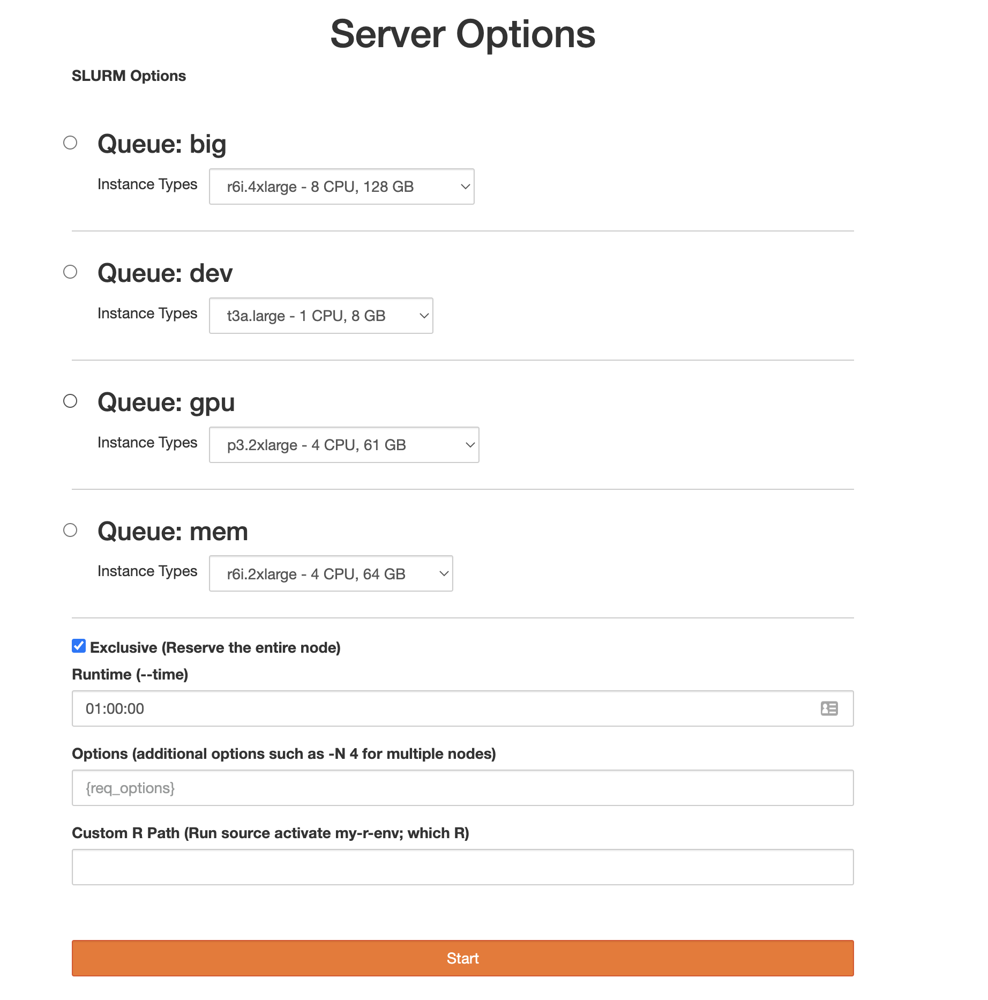

## Access

First, we recommend that you login to the cluster using the JupyterLab interface.  You should have received an email or Slack message with your SSH key, username, and password.

Once you've logged in you should see a launcher interface similar to this.



## Getting an Instance

Jupyterhub is smart enough to know that it is hooked up to a SLURM cluster. Using the launcher form will transparently submit a SLURM for you place you onto that node.

*Your interface may have slightly different options and/or queue names. For the onboarding tutorial we recommend a smaller instance, such as those in the `t3` or `t3a` family.*

When you're ready with your selection press 'Start'. It will probably take your node ~7 minutes to spin up, so go grab yourself your favorite beverage and then head on back.

Now from the Launcher open up a terminal.

```bash
git clone this-repo
cd this-repo
```

On the Jupyterhub file panel cd to your directory and go through any of the notebooks you think will be helpful!
