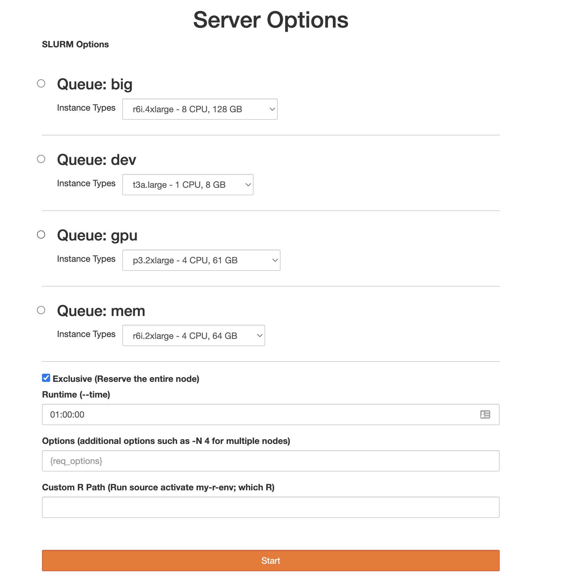
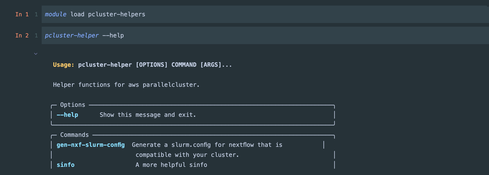

## BioAnalyze HPC 

BioAnalyze HPC is a templated HPC system based off of AWS ParallelCluster, with lots of features including for Bioinformatics and Genomics Analysis.

BioAnalyze is an Open Source framework for deploying Bioinformatics Analysis Infrastructure on AWS.

### System at a Glance 

At it's base BioAnalyze is a templated SLURM HPC cluster. It supplies tools and frameworks that are common to Bioinformatics work. Each tool or framework comes preconfigured to take advantage of your HPC.

#### Backend

* SLURM Cluster backed by AWS PCluster
* Multiple Queues
* Singularity
* Docker
* Nextflow
* Prefect
* Elastic File Storage (EFS) storage for `/apps` and `/scratch`
* Lustre (FSX) storage for `/fastscratch`

#### Front End Cluster Portal - User Interfaces  

The Jupyterhub interface has it's own web interface, but that interface is backed by the cluster. If you are logged into the JupyterHub interface you are also logged into the cluster.

* Jupyterhub interface (backed by SLURM)
* Dask Gateway
* RStudio
* Visual Studio Code

### Helper Libraries

BioAnalyze HPC includes a series of helper functions and libraries to help get the most from your HPC.

* PCluster Helpers
* More coming soon!

### Getting Started

Once you've received access credentials check out the [access](./access) page and the [workflow manager](./workflow-managers/index) for more information.

### Show Case

**Jupyterhub Spawner**

**PCluster Helper Libraries**

### Deploy all the Bioinformatics Related Things!

On AWS!
